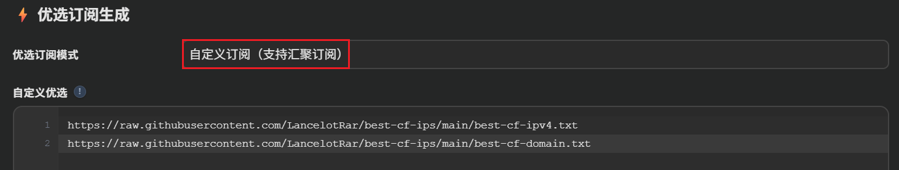

# best-cf-ips (ipv4)
## 项目功能
- 为多个公开或开源Cloudflare优选IP项目进行**聚合&去重&加地理标注&加国旗Unicode**，每3小时更新。  
- 可接入 [cmliu/edgetunnel](https://github.com/cmliu/edgetunnel)-自定义订阅汇聚。  

<p align="center">
  
</p>

## 应用效果
- API内容**示例**，更新日期以实际API结果为准。**示例内容不要导入任何工具，请使用下方API。**
- CN区域或包含HK，TW。
```txt
# 295 bestips updated at 2026-08-01 20:47
104.17.212.191:443#US 🇺🇸
104.25.0.8:443#US 🇺🇸
104.18.81.19:443#US 🇺🇸
158.180.69.78:443#KR 🇰🇷
45.77.254.160:443#SG 🇸🇬
104.17.107.76:443#US 🇺🇸
75.2.79.84:443#US 🇺🇸
104.19.220.22:443#US 🇺🇸
2.27.109.144:443#HK 🇭🇰
104.24.0.8:443#US 🇺🇸
139.162.23.48:443#SG 🇸🇬
162.159.197.1:443#US 🇺🇸
103.31.4.4:443#US 🇺🇸
207.148.119.176:443#SG 🇸🇬
104.17.0.8:443#US 🇺🇸
172.64.52.192:443#US 🇺🇸
172.64.34.62:443#US 🇺🇸
104.19.0.2:443#US 🇺🇸
172.64.52.124:443#US 🇺🇸
162.159.0.6:443#US 🇺🇸
91.110.209.123:443#HK 🇭🇰
104.18.223.253:443#US 🇺🇸
103.192.179.132:443#HK 🇭🇰
143.14.11.61:443#TH 🇹🇭
162.159.45.132:443#US 🇺🇸
47.57.181.17:443#HK 🇭🇰
45.76.158.201:443#SG 🇸🇬
118.40.112.188:443#KR 🇰🇷
108.162.192.7:443#US 🇺🇸
172.64.48.226:443#US 🇺🇸
172.64.157.39:443#US 🇺🇸
162.159.0.7:443#US 🇺🇸
91.110.182.10:443#HK 🇭🇰
172.64.91.69:443#US 🇺🇸
```

- 经代理客户端解析后，节点名称将显示**国家代码**以及**国旗**。
<p align="center">
  
</p>

## IP API

```
https://raw.githubusercontent.com/LancelotRar/best-cf-ips/main/best-cf-ipv4.txt
```

## 优选域名API，可配合IP API共同使用。非即时更新，内容固定。

```
https://raw.githubusercontent.com/LancelotRar/best-cf-ips/main/best-cf-domain.txt
```

## 感谢以下个人或组织的公开的优选IP筛选数据
- [bestcf](https://bestcf.pages.dev)
- [WeTest](https://www.wetest.vip/page/cloudfront/address_v4.html)
- [UOUIN](https://api.uouin.com/cloudflare.html)
- Tiancheng
- [Mia](https://t.me/MiaChatChannel)
- [Gslege](https://github.com/gslege/CloudflareIP)
- [IPDB](https://ipdb.api.030101.xyz)
- [VPS789](https://vps789.com/cfip/?remarks=ip)
- [vvHan](https://cf.vvhan.com)
- s5公益
- Luoli
## 感谢以下开源项目
- [ip2region](https://github.com/lionsoul2014/ip2region) - 离线 IP 地理位置查询库，用于IP转国家代码。